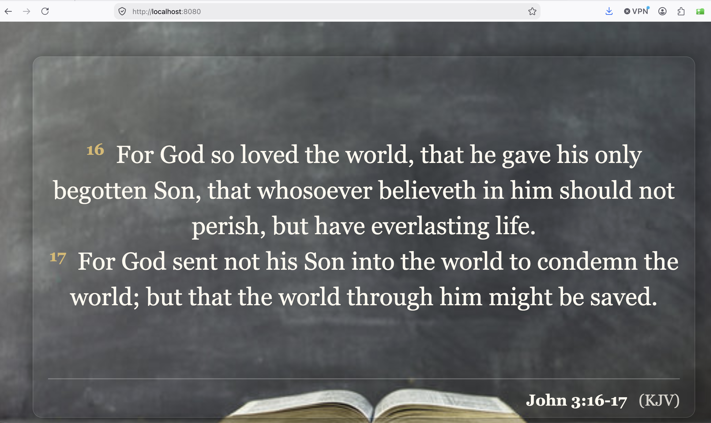
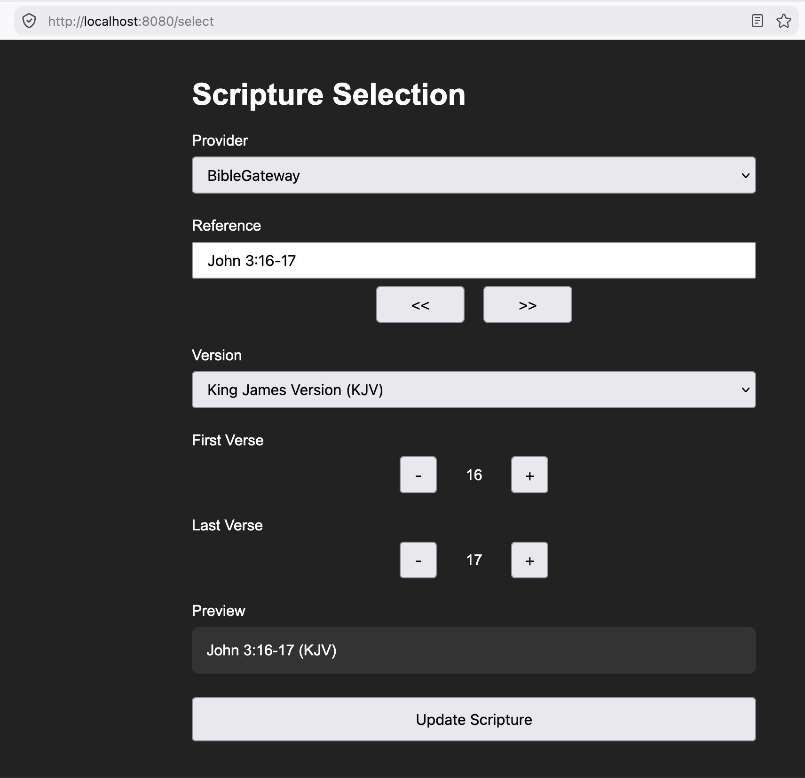

# Scripture Overlay

A lightweight Scripture display application for **OBS Studio**, live streaming, presentations, and browser-based Scripture display.

Scripture Overlay provides a web-based selection interface for choosing a Bible reference and translation, retrieves the requested passage through a configurable Bible provider, and displays the result through a browser-based overlay.

The application can be run directly with Python or as a **Docker container**.

## ✨ Features

* 📖 **Multiple Scripture providers**

  * [BibleGateway](https://www.biblegateway.com/), [Bible.com](https://www.bible.com/), [Olive Tree](https://www.olivetree.com/bible), [AI Bible Bot](https://openrouter.ai/)
* 🔎 Flexible Bible-reference parsing
* 📚 Bible-book aliases and canonical book-name normalization
* 🎛️ Improved Scripture selection interface
* 📺 Designed for **OBS Browser Source**
* ⚡ In-memory passage caching
* 🔄 Automatic overlay updates when the selected passage changes
* 🐳 Docker and Docker Compose support
* 🧠 Optional AI-powered Scripture retrieval
* 🐞 Provider-specific debugging output
* 🌐 Flask-based web application

---

## Preview

### Scripture Display



### Scripture Selection



The selection interface allows the operator to enter a Bible reference, select a translation/provider, adjust the verse range, review the resulting selection, and send it to the Scripture display.

---

# Architecture

The application separates Scripture retrieval from the presentation layer through a common `BibleProvider` interface.

```text
                         ┌─────────────────────┐
                         │   Selection UI       │
                         │     /select          │
                         └──────────┬──────────┘
                                    │
                                    ▼
                         ┌─────────────────────┐
                         │  Quotation Manager  │
                         └──────────┬──────────┘
                                    │
                                    ▼
                         ┌─────────────────────┐
                         │    BibleProvider    │
                         │      interface      │
                         └──────────┬──────────┘
                                    │
              ┌─────────────────────┼─────────────────────┐
              │                     │                     │
              ▼                     ▼                     ▼
       ┌──────────────┐     ┌──────────────┐     ┌──────────────┐
       │ BibleGateway │     │  Bible.com   │     │ Olive Tree   │
       └──────────────┘     └──────────────┘     └──────────────┘
                                    │
                                    

                                    │
                                    ▼
                         ┌─────────────────────┐
                         │ Scripture Display   │
                         │         /           │
                         └─────────────────────┘
                                    │
                                    ▼
                              OBS Browser
                                 Source
```

The provider interface currently recognizes:

```text
biblegateway
olivetree
biblecom
aibible
```

The provider architecture is implemented in `bible_provider.py`.

---

# Bible Providers

## BibleGateway

The default provider.

```text
provider = biblegateway
```

BibleGateway passages are retrieved from the web and parsed into the application's common Scripture format.

## Bible.com

Bible.com can be selected as an alternative Scripture source.

The provider also detects Bible.com's client-challenge response and reports it as an error rather than attempting to parse the challenge page as Scripture.

## Olive Tree

The Olive Tree provider allows Scripture to be retrieved from an installed/local Olive Tree Bible library.

This makes it possible to use locally available Bible content rather than relying exclusively on web retrieval.

## AI Bible Bot

The AI provider uses an OpenAI-compatible client configured to communicate with **OpenRouter**.

The current implementation uses:

```text
openrouter/free
```

and the OpenRouter API endpoint:

```text
https://openrouter.ai/api/v1
```

The API key is supplied through:

```text
OPENROUTER_API_KEY
```

The AI provider is considered **experimental**. AI-generated Scripture retrieval should not be treated as authoritative when exact textual fidelity is required.

If the AI provider is unavailable, the other providers remain usable.

---

# Requirements

For a native Python installation:

* Python 3.10 or later
* Flask
* Requests
* BeautifulSoup4
* lxml
* OpenAI Python package if the AI provider is used
* Internet connection for web-based providers

Install the dependencies with:

```bash
pip install -r requirements.txt
```

`watchdog` is not required by the current architecture.

---

# Quick Start — Python

Clone the repository:

```bash
git clone https://github.com/bawfeh/scripture-overlay.git
cd scripture-overlay
```

Install dependencies:

```bash
pip install -r requirements.txt
```

Start the application:

```bash
python app.py
```

The application is available at:

```text
http://localhost:8080/
```

---

# Configuration

## AI Provider

The AI provider requires an OpenRouter API key.

Set:

```bash
export OPENROUTER_API_KEY="your-api-key"
```

Alternatively, create a `.env` file:

```env
OPENROUTER_API_KEY=your-api-key
```

The Docker Compose configuration automatically loads variables from `.env`.

> **Important:** Never commit `.env` or API keys to the repository.

---

# Using the Application

## Scripture Display

Open:

```text
http://localhost:8080/
```

This is the main Scripture display and is intended to be used directly in a browser or as an **OBS Browser Source**.

## Scripture Selection

Open:

```text
http://localhost:8080/select
```

The selection interface allows you to:

1. Enter a Bible reference.
2. Select a Scripture provider.
3. Select a Bible translation/version.
4. Adjust the first verse.
5. Adjust the last verse.
6. Review the complete reference.
7. Submit the selection.

Once submitted, the selected passage becomes the current Scripture displayed by the main overlay.

---

# Bible Reference Handling

The application accepts Bible-book aliases and normalizes them to canonical book names.

For example:

```text
Matt 3:1
Matthew 3:1
MAT 3:1
  Matt   3:1
```

can be normalized to:

```text
Matthew 3:1
```

Numbered books are also handled with or without spaces:

```text
1Th 3:16
1 Th 3:16
1Thess 3:16
1 Thess 3:16
```

The canonical Bible-book aliases are stored in:

```text
data/bible_book_aliases.json
```

The provider layer loads this information and builds a lookup table for reference normalization.

---

# OBS Studio

Add the Scripture display as an OBS **Browser Source**.

Use:

```text
http://localhost:8080/
```

Set the Browser Source dimensions to match the desired overlay resolution.

For example:

```text
Width:  1920
Height: 1080
```

or use the dimensions appropriate for your production layout.

The browser overlay periodically checks the application's Scripture endpoint for changes. The actual Scripture passage is cached, so repeatedly displaying the same reference/version does not require another provider request.

---

# Docker

The application can be run without installing the Python environment directly on the host.

The repository contains both a `Dockerfile` and `docker-compose.yml`.

## Docker Compose

Build and start the application:

```bash
docker compose build
docker compose up
```

Or run it in the background:

```bash
docker compose up -d
```

The application will then be available at:

```text
http://localhost:8080/
```

Stop the application with:

```bash
docker compose down
```

### Docker volumes

The current Compose configuration mounts:

```text
./data       → /app/data
./static     → /app/static
./templates  → /app/templates
./debug      → /app/debug
```

This keeps application data, frontend files, templates, and debugging output outside the container.

The container is configured to restart automatically unless explicitly stopped.

---

# Docker Environment Variables

Create a `.env` file in the project directory if you use the AI provider:

```env
OPENROUTER_API_KEY=your-api-key
```

Docker Compose loads this file automatically.

Then start the application:

```bash
docker compose up -d
```

---

# API Endpoints

| Endpoint     | Purpose                                          |
| ------------ | ------------------------------------------------ |
| `/`          | Scripture display                                |
| `/select`    | Scripture selection interface                    |
| `/scripture` | Returns the current Scripture as JSON            |
| `/quotation` | Returns the current reference and version        |
| `/health`    | Returns application status and cache information |

Example:

```bash
curl http://localhost:8080/scripture
```

Example response:

```json
{
  "reference": "John 3:16-18",
  "version": "KJV",
  "verses": [
    {
      "number": 16,
      "text": "..."
    }
  ]
}
```

---

# Caching

Scripture passages are cached in memory.

When a previously requested reference and translation are requested again, the application can use the cached passage rather than contacting the Scripture provider again.

Changing the reference or translation causes the application to retrieve the new passage when it is not already cached.

---

# Debugging

Provider responses and errors can be written to the `debug/` directory.

This is particularly useful when troubleshooting:

* Changes to provider websites
* HTML parsing problems
* Bible.com client challenges
* AI provider errors
* Invalid Scripture references
* Translation/version problems

The debug directory is mounted as a Docker volume when using Docker Compose.

---

# Project Structure

```text
scripture-overlay/
│
├── app.py
├── bible_provider.py
├── biblegateway.py
├── biblecom.py
├── olivetree.py
├── aibible.py
├── quotation_manager.py
├── cache.py
│
├── Dockerfile
├── docker-compose.yml
├── requirements.txt
│
├── data/
│   └── bible_book_aliases.json
│
├── templates/
│
├── static/
│
├── debug/
│
└── docs/
    └── screenshots/
```

### Main components

| File                   | Purpose                                          |
| ---------------------- | ------------------------------------------------ |
| `app.py`               | Flask application and HTTP endpoints             |
| `bible_provider.py`    | Common provider interface and reference handling |
| `biblegateway.py`      | BibleGateway provider                            |
| `biblecom.py`          | Bible.com provider                               |
| `olivetree.py`         | Olive Tree provider                              |
| `aibible.py`           | AI/OpenRouter provider                           |
| `quotation_manager.py` | Manages the current Scripture quotation          |
| `cache.py`             | Passage caching                                  |
| `Dockerfile`           | Container image definition                       |
| `docker-compose.yml`   | Container deployment configuration               |

---

# Adding a New Bible Provider

The provider architecture is designed to make additional Scripture sources possible.

A provider should implement the common `BibleProvider` interface, including methods for:

```python
build_url()
parse_html()
get_versions()
```

A provider returns Scripture in the common format:

```python
{
    "reference": "...",
    "version": "...",
    "verses": [
        {
            "number": 1,
            "text": "..."
        }
    ]
}
```

This allows the selection interface, cache, quotation manager, and overlay to remain independent of the underlying Scripture source.

---

# Development

Run the application directly during development:

```bash
python app.py
```

For Docker-based development:

```bash
docker compose up --build
```

Because the application directories are mounted into the container, changes to templates, static assets, data, and debug files can be made without rebuilding the image.

---

# Known Limitations

* Web-based providers depend on the structure and availability of their respective websites.
* Bible.com may present client-challenge pages under some circumstances.
* Some Bible translations may have provider-specific formatting or availability limitations.
* The AI provider is experimental and should not be relied upon as an authoritative source for exact Scripture text.
* Internet access is required for the web-based providers.

---

# Acknowledgements

### Bible Providers

This project uses Scripture content made available through external Bible resources including BibleGateway, Bible.com, and Olive Tree.

### OpenRouter / AI

The optional AI provider uses an OpenAI-compatible client configured for OpenRouter.

### ChatGPT / OpenAI

The architecture, software design, implementation, debugging, and documentation of this project have been developed with assistance from ChatGPT.

Bible providers, OpenRouter, and OpenAI are independent organizations and do not endorse or sponsor this project.

---

# License

See the repository for the current license information.

---

## Repository

**GitHub:**
https://github.com/bawfeh/scripture-overlay
